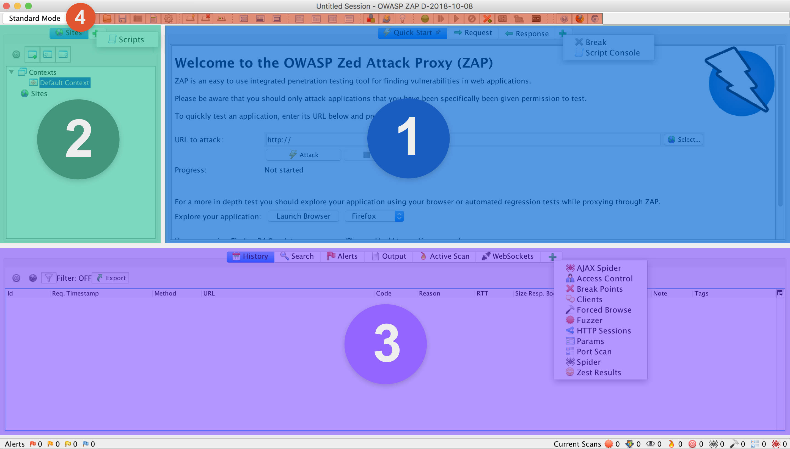
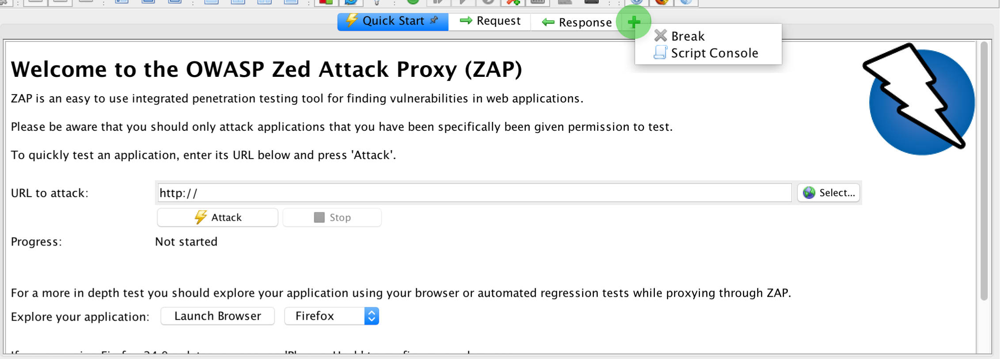

# GUI Overview
We are going to touch on the basics of the GUI to help you get more familiar with ZAP. Below you can see the GUI with 4 panels highlighted with more details below!

- [1 Workspace](#panel-1-workspace)
- [2 Sidebar](#panel-2-sidebar)
- [3 Tools](#panel-3-tools)
- [4 Toolbar](#panel-4-toolbar)

## Panel 1 Main Workspace
This panel enables you to view **Request** & **Response** headers and body. When you look at requests from **History** or from **Sites** the details are displayed in this section. or There is is also the **Script Panel** that allows you to modify/run/save your scripts and view any output from the scripts. 

## Panel 2 Sidebar

### Sites

#### Contexts

#### Sites
All requests proxied are used to be help construct a site tree. This helps you visualize the hierachy of your site. 

### Scripts
ZAP has a powerful scripting engine that allows you to modify/enhance different aspects of ZAP interactions. For example, you can modify the headers of every request 

## Panel 3 Tools
ZAP has tools that help you analyze your application

- History
- Search 
- Alerts
- Output
- Active Scan
- WebSockets
- AJAX Spider
- Access Control
- Breakpoints
- Clients
- Forced Browser
- Fuzzer
- HTTP Sessions
- Params
- Port Scan
- Spider
- Zest Results

### Spider/AJAX Spider

## Panel 4 Toolbar
The toolbar has a number of buttons to affects settings or the interface but I'm only going to touch on the aspects that are most commonly used. Over time we'll add more buttons!

### Button 1 - Options
All the detailed options for ZAPs functionality are found here! For example, if you want to set the default Maximum Duration a spider runs for, you set that in the **Options** panel

### Button 2 - Manage Add-ons
Often times there is an extra bit of functionality that an addons provide that you really need! I always add the **Groovy Scripting** and **Python Scripting** addons!

### Button 3-7 - Breakpointing
With breakpointing, you can intercept and modify requests in flight!

- https://github.com/zaproxy/zap-core-help/wiki/HelpStartConceptsBreakpoints
- https://www.youtube.com/watch?v=b6IR2KgiOcw

### Button 8 - Launch Browser
You can launche a browser pre-configured with a blank profile that is proxying through ZAP! This ensures you have a browser with a clean state (so you don't proxy your personal traffic!) with all the settings you need such as the ZAP CA configured.