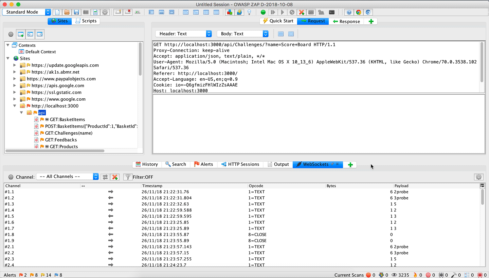

### Spidering
An important part of application security is getting an understanding of the breadth of the application. If you are not familiar with spidering, it's the process of going through the application, looking at things like `href` tags and other 
interesting bits to see what you can find.
Once we have the context setup, we can go ahead and test the spider out. Let's go ahead and configure the max time to be 1 minute, we don't want this to run forever, just a quick scan. You'll see it found some additional static assets but nothing terribly helpful. Since this is a single page application, there isn't much content generated server side for the spider to crawl. Most of the application interface is generated client side by angularjs.  In this case we could easily use a quick bash script to achieve similar affects.




**Links**
- [ZAP Wiki - Spidering](https://github.com/zaproxy/zap-core-help/wiki/HelpStartConceptsSpider)
- [Youtube - OWASP ZAP Spidering](https://www.youtube.com/watch?v=pGCBivHNRn8)

```sh
export T=http://localhost:3000/; 
curl -x 127.0.0.1:8080 "${T}" \
  | grep 'src' \
  | cut -d '"' -f 2 \
  | xargs -I{} curl  -x 127.0.0.1:8080 -sIXGET "${T}{}"

curl -x 127.0.0.1:8080 "${T}" \
  | grep 'href' \
  | cut -d '"' -f 2 \
  | xargs -I{} curl -x 127.0.0.1:8080 -sIXGET "${T}{}"
```

So the question becomes, how do you crawl applications that are primarily rendered client side? Luckily ZAP has an extenion to address this, the AJAX Spider!

#### AJAX Spider
To kick off the AJAX Spider, let's go back to the **Sites** tab and then right click on the request labeled `http://localhost:3000`. 
In the menu that popped up click `Attack > AJAX Spider`. This will prompt a dialog to appear with which you can configure the scan. Select 
the context. Start with selecting Firefox as the browser, then check the option **Show Advanced Options** and another tab **Options** will appear in the dialog. 
Go ahead and set *Number of Browser Windows to Open* to 2 and set *Maximum Duration* to 5. Now go ahead and click *Start Scan* to kicks things off.
In the bottom portion of ZAP, you will see a scrolling list being updated with new requests being tracked from the browser. If you switch to 
the browser that started you can see ZAP interacting with the application. It doesn't get everything but you can observe many more new requests 
have been discovered. In the **Sites** tab if you drill down into some of the urls such as `rest`, you will notice all these pages have a red spider icon 
next to them, indicating they were found by the AJAX Spider.


#### Active Scan
The spidering we've run have checked the application in non-intrusive ways. The Active Scan functionality of ZAP 
gets deep into testing malicious payloads against the application. It runs a suite of attacks on the parameters and 
endpoints of our application that it knows about. If we tried to run an **Active Scan** against Juice Shop without any
request history in ZAP, it would finish pretty quickly with less than ~100 requests. However, once we visit the main
page with traffic proxied, those requests are used by ZAP to figure out what surface area to attacks.

Here are a few of the many attacks that ZAP will run against your app with active scans
- SQL Injection
- Remote OS Command Injection
- Server Side Include
- Cross Site Scripting (Reflected)
- 
(For the nitty gritty of active scans [check here](https://github.com/zaproxy/zap-extensions/tree/master/src/org/zaproxy/zap/extension/ascanrules) to read the source)


##### Policy Tuning
The thing that controls Active Scans are Scan Policies. Scan policies control whether a series check is run and with what
strength. For example, there is an active scan check for checking SQL Injections for Oracle. We know the application database is not Oracle, so we can run this check. We also know our application has no sort of SOAP functionality, so 
we can remove those checks as well. 

For example, with the plugin *SQL Injections*, if the *Strength* is set to low, only 4 requests will be made against a node whereas if you set the 
strength to *Insane*, the max number of requests jumps to 100!
