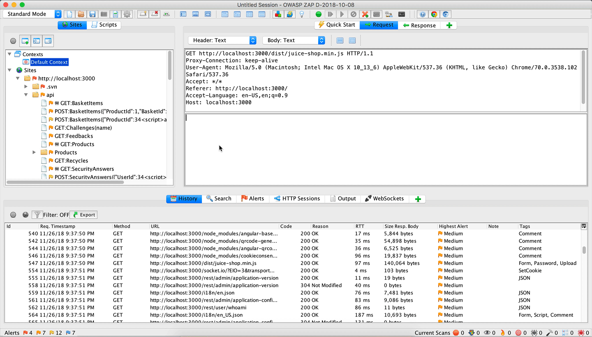

## Configuring Contexts
In ZAP, there the configuration of context, whhich ZAP uses are used to group together a set of urls. In the case of Juice Shop,
there is really only one url to configure, but other applications may have endpoints with different hostnames that use the 
same underlying application that could be grouped together with a Context.

### Adding a URL
At minium, a context needs to have a URL, to get things started let's add the application root url. The easiest way to do this is
to focus in the ZAP window and Launch Browser in the Quick Start window.

In the browser that ZAP just started, visit `http://localhost:3000/`, once the page loads, go back to the ZAP application. 
Near the bottom of ZAP, there will be a number of tabs, (History, Search, Alerts, Output), click on the History tab and confirm 
you can see requests being tracked. After that, in the left sidebar of ZAP, under **Sites** you will see a set of url trees generated from the traffic. Right click (or control click) the url root `http://localhost:3000/` and in the context menu that 
popped up `Include in Context > Default Context`. It will bring up the context editor and you will see it added `http://localhost:3000.*`

